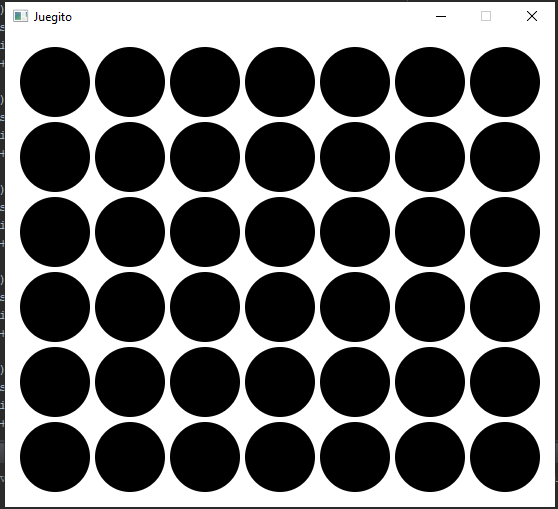
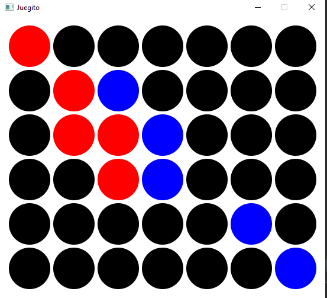
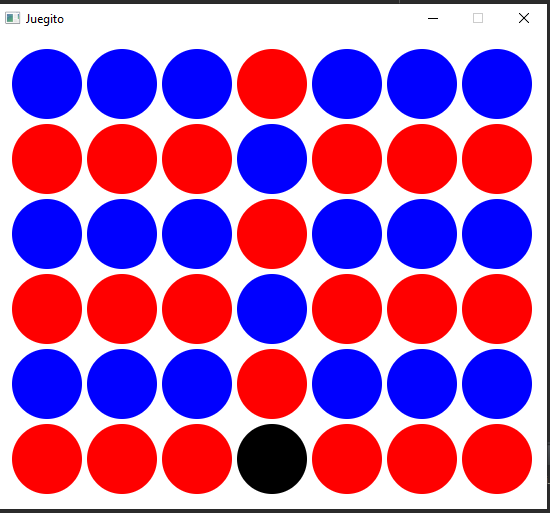
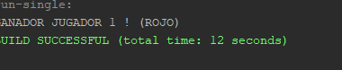
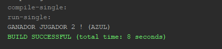
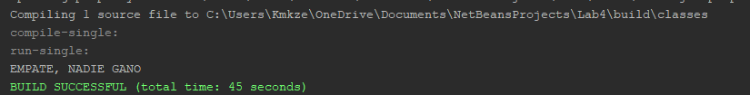

#Connect-4-JAVAFX

## Vista previa del proyecto
Si quieres hechas un vistazo al proyecto, te recomiendo:

Si Gana Jugador 1(Empieza el primero 1)

Si Gana el Jugador 2(Empieza 2do)

Si no hay ganador 3(Empate)

**NOTA**: *SE QUE ES UN GRAVE ERROR NO MOSTRAR LOS GANADORES EN LA INTERFAZ, EN ESE TIEMPO EL PROFE ME RECARCO ESO, PERO ESTABA APRENDIENDO Y POR EL TIEMPO NO LOGRE LLEGAR A LA SOLUCION QUE SE MOSTRARAN EL GANADOR O EL EMPATE EN EL INTERFAZ**

## Descripción 📑

[PDF Del Problema](assets/pdf/LABORATORIO4B.pdf)

## ¿Qué he aprendido en este proyecto? 🙇🏻 

-Implementación de interfaces gráficas de usuario (GUI) utilizando JavaFX.

-Desarrollo de lógica de juego para "Conecta Cuatro", incluyendo la detección de victoria y empate.

-Manejo de eventos de usuario, como clics del ratón para colocar fichas en el tablero.

-Aplicación de programación orientada a objetos en un proyecto práctico.

-Diseño e implementación de un sistema de turnos para un juego de dos jugadores.

-Creación de una matriz 2D para representar el estado del juego.

-Implementación de algoritmos para verificar secuencias ganadoras en diferentes direcciones (horizontal, vertical, diagonal).

-Uso de colores y formas gráficas para representar el estado del juego visualmente.

-Manejo de estados del juego (continuar, ganar, empatar).

-Documentación de código utilizando Javadoc.

-Gestión de un proyecto de software desde su concepción hasta su implementación.

-Aplicación práctica de conceptos de programación en un contexto de juego interactivo.

## Tecnologías 🛠
<!-- Iconos sacados de: https://github.com/hendrasob/badges/blob/master/README.md y https://github.com/alexandresanlim/Badges4-README.md-Profile -->

## Autor ✒️
**Kamikazejar**

* <a href="https://www.linkedin.com/in/rodrigocarmonah/" target="_blank">LinkedIn</a>
* <a href="https://rodrigocarmonaherrera.com/" target="_blank">Portafolio Web</a>
* [Email](mailto:rcarmonah@outlook.com)

  
## Instalación 
*APACHE NET BEANS Y IMPORTAR EL PROYECTO*
  
## Licencia 📄
MIT Public License v3.0
No puede usarse comencialmente.
